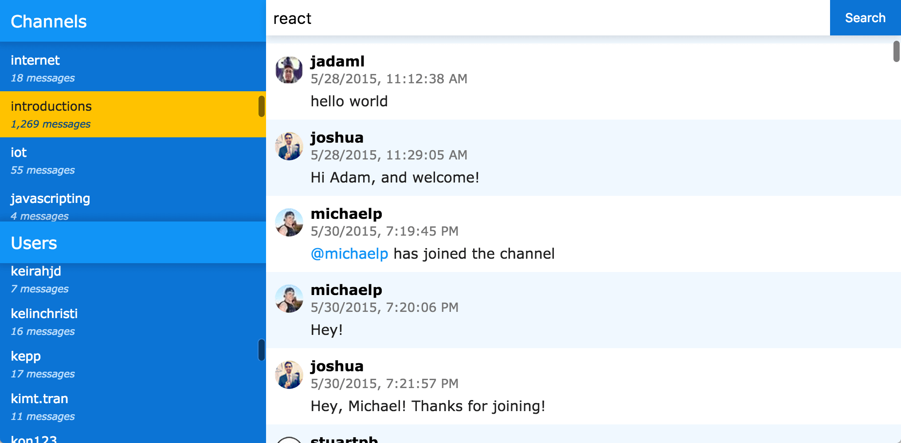

# Slack Export Viewer

*Browse and search slack export archives in the browser.* 

## Explanation

This simple app provides a limited API for querying the JSON output of Slack exports, as well as a React.js-based web
interface for consuming the API.

## Instructions

1. Install the dependencies.  
    `npm i` 
    
2. Generate a Slack export and unzip the contents to the `slack_export` directory.

3. Run the app.  
    `npm start`
    
4. Open `localhost:5000` in your browser.

## Future Improvements

#### Leverage Proper Indexes

There is no database or indexing; it merely loads and filters the JSON in memory. This could be ameliorated by either:
- Creating a backing store, with appropriate indexes, and loading the data through a separate script.
- Using an in-memory index.

Perhaps in the longer term, a database that supports full-text search could be added. 

#### Pagination

There is no pagination, so each query loads all of the available results. Pagination would load the first page of 
results and offer a token or use query params for retrieving subsequent pages. The client could then request the next
pages through an infinite scrolling mechanism.

#### Get Message with Context

Similar to the indexing issue, selecting a message loads the entire channel for that message, before scrolling to the
message. It would be much better to load a subset of messages around a selected message, and send that to the client.
Infinite scrolling could then load the later messages, as well.

#### Word Cloud

It would be fun to add a word cloud, globally, per user, and per channel, to see what the most commonly used words are.

#### Stats

It would be cool to have stats on some of the following (on global, per channel, and per user):
 - Count of messages by time of day, day of week, and month of year
 - Sentiment analysis
 - Average message length
 - Keyword/topic modeling -- where has a keyword or topic appeared, and with what frequency (e.g., histogram of topic
 density per channel or user, over time)

## License

The MIT License (MIT)

Copyright (c) 2017 Joshua Hutt

Permission is hereby granted, free of charge, to any person obtaining a copy of this software and associated documentation files (the "Software"), to deal in the Software without restriction, including without limitation the rights to use, copy, modify, merge, publish, distribute, sublicense, and/or sell copies of the Software, and to permit persons to whom the Software is furnished to do so, subject to the following conditions:

The above copyright notice and this permission notice shall be included in all copies or substantial portions of the Software.

THE SOFTWARE IS PROVIDED "AS IS", WITHOUT WARRANTY OF ANY KIND, EXPRESS OR IMPLIED, INCLUDING BUT NOT LIMITED TO THE WARRANTIES OF MERCHANTABILITY, FITNESS FOR A PARTICULAR PURPOSE AND NONINFRINGEMENT. IN NO EVENT SHALL THE AUTHORS OR COPYRIGHT HOLDERS BE LIABLE FOR ANY CLAIM, DAMAGES OR OTHER LIABILITY, WHETHER IN AN ACTION OF CONTRACT, TORT OR OTHERWISE, ARISING FROM, OUT OF OR IN CONNECTION WITH THE SOFTWARE OR THE USE OR OTHER DEALINGS IN THE SOFTWARE.